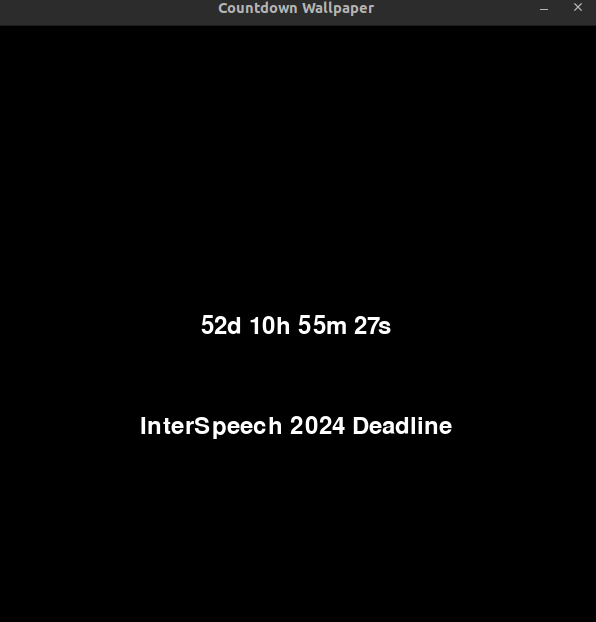

# Countdown app

This is a simple countdown app that counts down days, hours, minutes, and seconds to a specified date. Example: Interspeech 2024.

## Usage

Download some required packages:

```bash
pip install pygame 
pip install pyinstaller
```

Making an executable:

```bash
pyinstaller --onefile dayleft.py
```

You can then run the executable in the `dist` folder. Cheers!

## Screenshot

<center>
    
</center>
